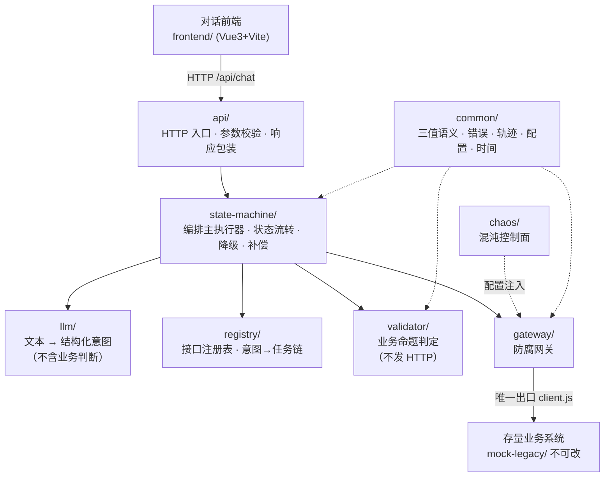
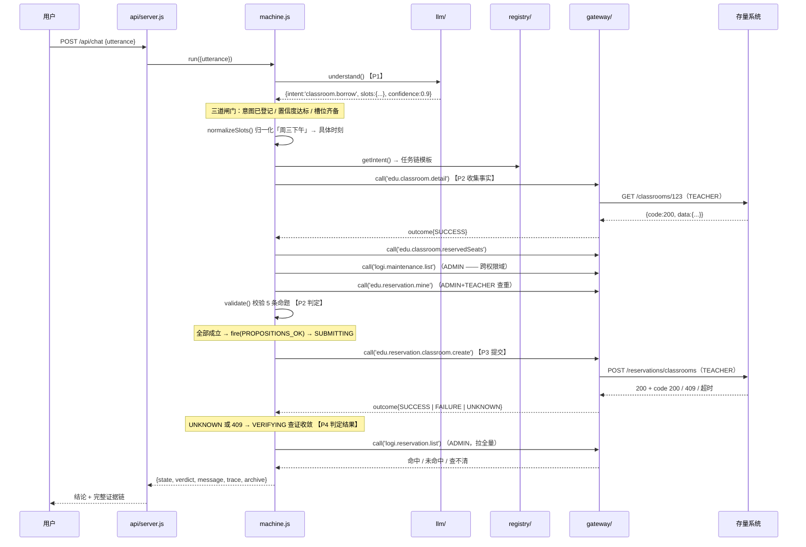

# 系统架构

> 定位：本文件的读者是**要动这份代码的人**。它回答的问题是——**分了几层、谁依赖谁、一次办事的数据怎么流、每条不变量落在哪个文件里**。
>
> 业务规则见 `业务边界与责任域.md`；为什么这样设计见 `智能体设计.md` 与 `设计方案/`。

---

## 一、一句话架构

```
对话前端  →  编排引擎（自研核心，零依赖 Node）  →  防腐网关  →  存量业务系统（不可改）
             └─ LLM 只做理解，状态机负责决策与执行 ─┘
```

**架构的唯一目的**：让「一次自然语言办事」在**存量系统不可改、协议异构、接口会抖动**的前提下，仍然做到**结果唯一确定、过程可解释、副作用可控**。

---

## 二、分层与依赖方向



**依赖方向强制单向，禁止反向**：

```
api → state-machine → { llm, registry, validator, gateway } → 存量系统
chaos（控制面）→ gateway（执行面）
common ← 所有层都可依赖（它不依赖任何人）
```

### 三条不可违反的边界

| 边界 | 规则 | 怎么机器校验 |
|---|---|---|
| **HTTP 出口唯一** | 只有 `gateway/client.js` 允许 `fetch` 存量系统 | 全程搜索 `fetch(`：命中处应为 1 个文件 |
| **副作用出口唯一** | 只有 `SUBMITTING` 状态允许发起写操作 | `states.js` 的 `canWrite(state)` |
| **LLM 权限最小** | `llm/` 只输出「意图名 + 槽位」，**无权决定调哪个接口** | `registry/plans.js` 里意图→接口是**静态映射**，不经过 LLM |

> 这三条不是风格偏好，而是**项目主张能否成立的前提**。任何一条被绕过，"不改存量系统也能安全代办"这句话就不成立了。

---

## 三、模块清单

### 3.1 `api/` —— 最外层

| 文件 | 职责 |
|---|---|
| `server.js` | `node:http` 服务；5 个路由；统一错误包装（未预期异常也明确返回，不吞） |

**允许**：接收请求、参数校验、调用状态机、包装响应。
**禁止**：直接调存量系统、写业务判断。

### 3.2 `state-machine/` —— 核心编排层

| 文件 | 职责 |
|---|---|
| `states.js` | **状态枚举 + 事件枚举 + 转移表**（纯数据）。`canWrite()` / `auditTransitions()` |
| `machine.js` | **主执行器 `run()`**。P1→P6 全流程；`decide()` 降级循环；`rollbackCompleted()` 逆序补偿 |
| `normalize.js` | 槽位归一化：「周三」→ 日期、「第7节」→ 时刻、「下午」→ [7,8] |
| `resolve.js` | 教室名 → 真实 id（人类可读 ↔ 系统标识的翻译层） |
| `collectors.js` | 事实收集器：`COLLECTORS` 按事实键决定调哪个接口、用哪个身份 |
| `verify.js` | 业务键查证：把 `UNKNOWN` 收敛为 `FOUND`/`NOT_FOUND`/`INCONCLUSIVE` |
| `compensate.js` | 补偿动作；补偿矩阵 |
| `index.js` | **门面：对外只暴露 `run()` 一个入口** |

> **门面只有 `run()` 一个出口** —— 没有第二个入口，就没有旁路。这是状态机纪律能成立的结构性保证。

### 3.3 `llm/` —— 只做理解

| 文件 | 职责 |
|---|---|
| `prompt.js` | `SYSTEM_PROMPT`（**从注册表生成，但不含任何接口信息**）、`buildUserMessage()` |
| `schema.js` | `INTENT_OUTPUT_SCHEMA` + **零依赖** JSON Schema 校验；`CONFIDENCE_THRESHOLD = 0.55` |
| `parser.js` | 调用 DASHSCOPE（OpenAI 兼容模式）；`temperature: 0`、`response_format: json_object`；校验失败重试 |
| `index.js` | `understand()` —— **三道闸门**：① 意图必须已登记 ② 置信度达标 ③ 必填槽位由注册表计算缺口 |

**三道闸门是关键**：LLM 的自由度止于"从已登记意图里挑一个名字"，且必须过置信度与槽位检查。**无 LLM 也能跑**（自检全离线）。

### 3.4 `registry/` —— 边界的可执行载体

| 文件 | 职责 |
|---|---|
| `interfaces.js` | **12 条**存量接口元信息（身份/副作用/幂等键/查证/补偿/前置命题）+ `auditRegistry()` 自检 |
| `plans.js` | **意图 → 任务链**静态映射；槽位定义；降级策略 |
| `index.js` | 门面 + `selfCheck()`（注册表 / 状态机 / 意图三项检查） |

### 3.5 `validator/` —— 业务命题判定

| 文件 | 职责 |
|---|---|
| `propositions.js` | 6 条命题定义（含 `requires` 事实依赖声明）；`requiredFacts()` |
| `index.js` | `validate()` 执行器 + `explainFailures()` |

**关键设计**：命题声明 `requires`，状态机据此**自动生成 gather 步骤**（`requiredFacts()`）。→ **新增业务规则不需要改调用链代码**。

### 3.6 `gateway/` —— 防腐网关

| 文件 | 职责 |
|---|---|
| `adapters.js` | **三值判定核心** `judgeVerdict()`；`BIZ_CODE_MEANING`；`isAmbiguous()` |
| `identity.js` | 多身份凭证池 `acquire/refresh/clear/status`；token 缓存 25 分钟 |
| `client.js` | **统一出口** `call(interfaceId, {pathParams, query, body})` —— **全项目唯一允许 `fetch` 存量系统的地方** |
| `index.js` | 门面 + `health()`（三个身份探测） |

### 3.7 `chaos/` —— 混沌控制面

| 目录 | 状态 |
|---|---|
| `scenarios/` | **空 —— 尚未实现**。见 `docs/路线图与未完成项.md` |

设计上：`chaos` 是**控制面**，只产出"对哪个接口注入什么故障"的配置，由 `gateway`（执行面）执行。默认撤防。

### 3.8 `common/` —— 不依赖任何上层

| 文件 | 职责 |
|---|---|
| `tristate.js` | **三值语义** `Verdict.SUCCESS / FAILURE / UNKNOWN`；`outcome()` |
| `errors.js` | 错误类型体系（`IntentError` / `SlotMissingError` / `PreconditionError` / `IdentityError` / `UnresolvedOutcomeError` / `CompensationError`） |
| `trace.js` | `Trace` 类；`Stage` 枚举（P1_UNDERSTAND…P6_EVIDENCE）；`toView()` / `toArchive()` |
| `config.js` | 零依赖配置加载，**环境变量优先** |
| `time.js` | 时区处理：`toOffsetDateTime()` / `fromLocalDateTime()` / `overlaps()` / `describeRange()` |

---

## 四、一次办事的数据流

以主场景「帮我借周三下午的数智楼222」为例：



**数据流的关键点**：

1. **只有最后一个箭头是写**。前面全是只读——这由 `canWrite()` 保证，不是靠自律。
2. **事实收集跨了两个权限域**（TEACHER 读教务 + ADMIN 读后勤）。这不是实现细节，是业务必然（见 `接口注册表.md` §五）。
3. **`409` 和「超时」走同一条收敛路径**（`VERIFYING`），因为两者都是歧义信号。

---

## 五、不变量 → 代码落点

每条不变量都必须能指到一个**具体文件**，否则它只是口号。

| 不变量 | 含义 | 落点 |
|---|---|---|
| **I1** 事实齐备方可写入 | 缺事实不得假设其成立 | `collectors.js` 的 `failures` → `machine.js` `fire(FACT_UNAVAILABLE)` → `REJECTED`（保守终止） |
| **I2** 至多一条有效记录 | 不重复提交 | `P-NOT-ALREADY-MINE`（先看是不是自己）+ `P-SLOT-FREE`（再看是不是别人）+ `verify.js` 命中即**禁止重试** |
| **I3** 结果必须唯一确定 | 不留悬空结论 | `tristate.js` 三值 + `states.js` 的 `SUBMITTING --CALL_UNKNOWN/CALL_CONFLICT--> VERIFYING` + `VERIFY_INCONCLUSIVE → UNRESOLVED` |
| **I4** 可解释 | 说得出依据 | `trace.js`：`step()` 强制 `evidence` 字段（省略即抛错）；转移表 `guard` 字段写明判断依据 |
| **I5** 最小身份 | 按需取身份 | `registry` 的 `requiredRole` + `identity.js` 凭证池；token 不外泄 |
| **I6** 副作用可补偿或显式登记不可补偿 | 不留半成品 | `interfaces.js` 的 `compensate` / `uncompensable` + `auditRegistry()` 强制校验 + `compensate.js` |

> **`auditRegistry()` 在启动时自动运行，任一项不过就打屏告警。** 它本轮首次运行就揪出 3 个真实问题——这条不变量不是纸上的。

---

## 六、关键技术约束

### 6.1 零第三方运行时依赖

`orchestrator/package.json` 只有 `type: module` 和 3 个 scripts，**没有 `dependencies`**。

| 通常要用的库 | 本项目怎么替代 |
|---|---|
| `express` / `koa` | `node:http`（`api/server.js`） |
| `axios` / `node-fetch` | Node 18+ 全局 `fetch`（`gateway/client.js`） |
| `ajv` / `zod` | 自研零依赖校验（`llm/schema.js`） |
| `dayjs` / `moment` | 自研时区处理（`common/time.js`） |

**为什么**：① 部署零门槛，`node src/api/server.js` 直接跑；② 依赖链上不留不可控的协议判定逻辑；③ 时间格式的每个假设都必须自己写清楚——而这个项目的核心难点恰恰就在时间语义上。

### 6.2 ESM

`"type": "module"` → 一律 `import`/`export`。不要混入 `require`。

### 6.3 配置

`config/default.json`：存量地址、三个身份、LLM、`server.port`（**8090**）、时区。
**环境变量优先于文件**（`common/config.js`）。**密钥只放环境变量**（`DASHSCOPE_API_KEY`），不写进 JSON。

---

## 七、这份架构明确不做什么

| 不做 | 理由 |
|---|---|
| 不引入数据库 | 编排层是**无状态**的：状态存在于一次 `run()` 的生命周期内，事实全部现取。加持久化会引入新的不一致源 |
| 不做分布式事务 / 2PC | 存量系统不可能配合。采用**编排式 Saga** + 注册表声明的补偿动作 |
| 不在引擎里缓存业务事实 | 事实一旦被缓存就会过期，而"教室是否可用"正是**强时效**信息。宁可每次现查 |
| 不做通用工作流引擎 | 只有两个意图，且任务链是**静态声明**的。通用化会稀释"边界明确"这个优势 |
| 不让 `llm/` 接触接口信息 | 一旦 LLM 知道接口，它就会试图决定调哪个——那是最危险的一种失控 |
| 不自动重试写操作 | 写操作没有幂等保证。**重试前必须先查证**，这是硬约束（`verify.js` 的注释里写死了） |

---

## 八、当前完成度

| 层 | 状态 |
|---|---|
| `common/` `registry/` `validator/` `gateway/` `llm/` `state-machine/` `api/` | ✅ 已实现，离线自检 30 项通过，端到端 5 场景实测通过 |
| `chaos/` | ❌ 空。**当前最高优先级** |
| `frontend/` | ❌ 空 |
| `mock-legacy/` | ✅ 已跑通，**源码改动 0 个文件** |

详见 `docs/路线图与未完成项.md` 与 `docs/变更记录/`。
