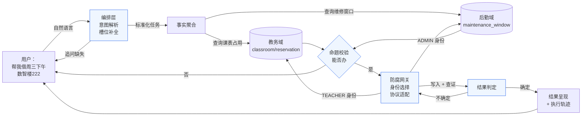

# 业务边界与责任域

> 本文定义本系统覆盖的业务链段、三个边界决策点及其裁决口径，作为后续需求评审、
> 待办项判定与文档写作的统一依据；涉及边界的新需求，先对照本文 §五 速查表裁决，
> 越界项须先在本文登记后再讨论实现。
>
> 相关文档：`智能体设计.md`（核心命题与系统模型）、`存量系统改造说明.md`（被测系统改造口径）、
> `../设计方案/2026-09-24-编排层职责切分与场景收敛-设计方案.md`（本轮取舍）、
> `../设计方案/2026-09-24-系统设计方案/`（各机制怎么做，13 章）、
> `../研发规范/文档驱动开发规范.md`（开发流程）。

## 一、定位

**本系统 = 在"无权修改的存量业务系统"之上，架设的一层"自然语言办事代理 + 跨系统任务编排器"。**

- 使用方：校园内**没有系统操作权限、也不懂接口**的普通用户（学生、教师、辅导员）。
- 业务链：用户说一句自然语言 → 系统补全意图 → 跨系统收集事实 → 判定是否可办 → 以正确身份调用存量接口 → 判定结果真伪 → 遇到异常恢复。
- 与核心抽象的关系：`智能体设计.md` 声明"教室借用只是**验证场景**，研究对象是
  **面向不可修改的存量系统的、可解释可恢复的任务编排**"；本文定义该验证场景**具体的业务边界**——
  即系统对真实业务链建模到什么程度、刻意不建什么及理由。

**定位的关键一句话（答辩口径）**：

> 我们不改存量系统的**一行代码**，却让它长出了自然语言接口。

## 二、业务链全景

以主场景「教室借用（含占用冲突降级 + 设备报修联动）」为例：

> 注：图中"教务域"与"后勤域"在当前实现里**由同一个存量系统承载**（见 §四 P1 裁决），
> 但它们在**权限域**与**事实域**上真实分离——这是本项目的立论基础。

### 责任域划分

| 业务段 | 谁执行 | 系统是否建模 | 建模形态 / 说明 |
| --- | --- | --- | --- |
| 自然语言理解（意图、槽位、缺口） | 编排层 | **已建模** | LLM 意图解析模块；输出结构化 JSON，不产生任何副作用 |
| 事实聚合（占用 / 维修 / 容量 / 状态） | 编排层 | **已建模** | 跨 ≥3 个接口、跨 ≥2 个权限域聚合；见 §三 P2 |
| 前置条件判定（能不能办） | 编排层 | **已建模** | 命题校验层；在写操作发起**之前**拦截 |
| 身份选择与协议适配 | 编排层 | **已建模** | 防腐网关 + 多身份凭证池；见 §三 P3 |
| 结果三值判定与查证收敛 | 编排层 | **已建模** | 状态机 + 幂等守卫；见 §三 P4 |
| 补偿与回滚 | 编排层 | **已建模** | 接口注册表声明补偿动作；编排式 Saga |
| 故障注入与容错验证 | 编排层 | **已建模** | 混沌模块（控制面）+ 故障代理（执行面） |
| 预约的**审批**与生效 | 存量系统 | **不建模** | 审批在存量系统内部；编排层止于"提交申请"这一动作 |
| 座位级颗粒度调度 | 存量系统 | **不建模** | 编排层只做**教室级**判定；座位粒度仅用于读取占用事实 |
| 排课（谁能用这间教室上课） | 存量系统 | **不建模** | 教务既有职责；编排层只**读**其结果 |
| 维修的派单、执行、验收 | 存量系统 | **不建模** | 编排层只**提交工单**与**查询进度** |
| 用户体系与细粒度权限 | 存量系统 | **不建模** | 编排层只维护"调用存量接口所需的最小身份集" |

## 三、三个边界决策点与裁决

边界由三个切口决定：**换成什么场景（P1）、做到什么颗粒度（P2）、以谁的名义做（P3）**。

### P1 场景边界

- **裁决：单存量系统，双权限域，不做第二个系统。**
- **理由**：跨系统叙事的实质不是"两台服务器"，而是**"信息不对称 + 权限不对称"**：
  查维修窗口需要 `ADMIN` 身份，建整间教室预约需要 `TEACHER` 身份，而"这间教室现在能不能借"
  这个判定**必须同时依赖两类事实**。任一侧单独都答不出来，这就是编排层不可替代的证明。
- **被排除的选项**：① 另起一个独立后端服务伪造"第二个系统"——引入跨进程一致性问题，
  却没有增加任何真实的业务复杂度；② 改造存量系统把两个域合并——违反"零侵入"前提。
- **明确记入**：答辩时**不要**说"我们对接了两个系统"，要说
  **"我们对接了一个存在权限与事实鸿沟的存量系统，跨域聚合是它的真实难点"**。

### P2 颗粒度边界

- **裁决：编排层做教室级判定，座位级只读不写。**
- **理由**：存量系统的 `GET /classrooms/{id}/reserved_seats` 返回的是**座位 ID 数组**，
  而写操作 `POST /reservations/classrooms` 是**整间教室**粒度。也就是说，
  **读的视角与写的视角不一致**——这是真实存在的语义鸿沟，必须由编排层做一次
  "座位集合 → 教室是否可用"的推导（判定规则：该时段占用座位数 > 0 即视为不可用）。
- **被排除的选项**：① 编排层也做座位级预订——那只是把存量接口包一层，
  体现不出"跨系统聚合判定"的价值；② 忽略座位占用只查整间预约——
  会漏判"有人订了座位但没订整间"的情况，导致脏数据（这正是命题校验要防的）。

### P3 身份边界

- **裁决：编排层维护多身份凭证池，由接口注册表声明所需身份，网关按需取用。**
- **理由**：实测确认权限是**分裂**的——

| 动作 | 所需身份 | 实测结果 |
| --- | --- | --- |
| 查教室详情 / 查时段占用 / 建整间预约 / 撤销预约 | `TEACHER` | 成功 |
| 查维修窗口 / 建维修窗口 / 管理端列表 | `ADMIN` | 成功 |
| 建座位预约 | `STUDENT` | 成功 |
| 用 `STUDENT` 查维修窗口 | — | `HTTP 403`（过滤器层拒绝） |
| 用 `ADMIN` 建整间预约 | — | `HTTP 200` + body `code=403`（方法层拒绝） |

  最后一行是本项目最有价值的一处真实异构：**同一个"无权限"语义，存在两种互不相同的表达**。
  网关若只看 HTTP 状态码，会把"无权限"误判为"成功"（见 §四 P5）。
- **被排除的选项**：① 用 `ADMIN` 一个账号打通所有接口——`ADMIN` 建不了预约，
  技术上不成立；② 要求存量系统放宽权限——违反零侵入，且权限分裂本身是我们要利用的真实约束。

## 四、系统管到什么、不管到什么（口径速查）

| 管（已建模） | 不管（明确不建模） |
| --- | --- |
| 自然语言 → 结构化意图与槽位 | 训练 / 微调大模型（只调用第三方 API） |
| 槽位缺口识别与多轮追问 | 开放域闲聊（超出业务场景的输入直接拒答） |
| 跨接口、跨权限域的事实聚合与推导 | 存量系统内部的业务逻辑与数据一致性 |
| 前置条件判定与非法请求拦截 | 存量系统数据库的任何写操作（除通过其 API） |
| 多身份选择、协议适配、参数形态转换 | 存量系统的鉴权模型本身 |
| 调用结果的三值判定（成功 / 失败 / **不确定**） | 把"不确定"当作"失败"处理（禁止） |
| 幂等守卫：重试前的业务键查证 | 依赖存量系统提供幂等（它不提供） |
| 补偿动作执行与补偿失败的处理 | 分布式事务 / 2PC（存量系统不可能配合） |
| 故障注入与容错验证 | 对真实线上生产系统注入故障 |
| 执行轨迹与可解释性证据链 | 生产级的日志检索、监控告警平台 |

## 五、判定原则（裁决口径）

1. **零侵入优先**：任何需求先问"能否只通过存量系统的公开 HTTP 接口 + 环境变量实现"。
   确认必须改动存量源码时，先在 `存量系统改造说明.md` 登记改动内容、理由与影响面，
   再谈实现。**当前改动量为 0 个文件。**
2. **事实可获性**：任何写操作发起前，"其前置条件所依赖的事实"必须已被收集，
   且收集路径必须可复现。无法获取的事实在文档中显式登记为缺口，**不得假设其成立**。
3. **结果确定性**：任何接口调用结束后，系统必须能回答"到底成没成"。
   无法判定时，必须存在查证路径；若无查证路径，该接口**不得**进入可编排清单。
4. **权限最小化**：每次调用只使用**该接口所需的最小身份**，不得为了省事复用高权限身份。
5. **改动最小**：新需求先对照 §四 速查表；确认越过边界时，先在此处登记边界变化再谈实现。
6. **异构不消除**：存量系统的协议不一致、命名混用、错误语义混乱，
   **不是缺陷清单，是本系统存在的前提**。任何"顺手修好"的想法一律驳回。
