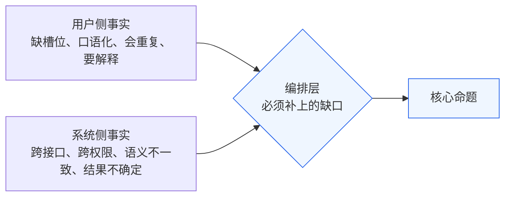
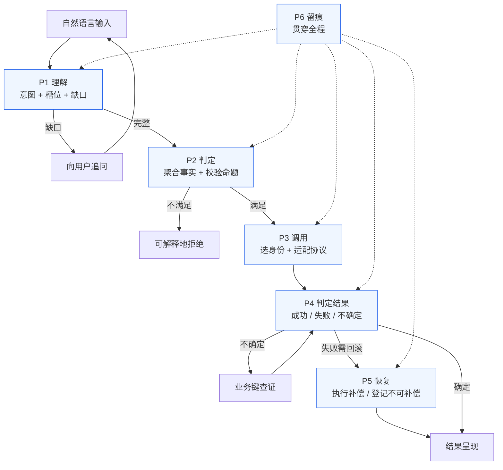

# 智能体设计

> 本文是编排层的**设计基线**：先扫描现实业务事实，再归纳边界，提炼不变量，
> 由不变量反推异常，压缩为核心命题，最后才让系统围绕命题建模。
> 方法依据见 `../../../../../../epan/obsidianwarehouse/03-技术/系统设计.md`（从现实事实到核心命题）。
>
> **本文只回答"系统必须能表达和维护哪些命题"，不回答"代码怎么写"。** 实现细节见 `../研发规范/` 与源码。
>
> 相关文档：`业务边界与责任域.md`（边界裁决）、`存量系统改造说明.md`（被测系统口径）、
> `../设计方案/2026-09-24-编排层职责切分与场景收敛-设计方案.md`（本轮取舍留档）、
> `../设计方案/2026-09-24-系统设计方案/`（**本文 §7 系统模型的细化展开，13 章**）。

---

## 一、设计前提：为什么不能"直接包一层接口"

如果把编排层做成一串固定的 HTTP 调用（查课表 → 查维修 → 提交），它就是一个脚本，不是智能体。
真正需要设计的东西出现在**三种时刻**：

```text
时刻 A：用户说的话不全  →  系统该问什么、不该问什么
时刻 B：事实散落在多个接口和权限域  →  系统怎么把它们拼成一个可判定的结论
时刻 C：调用发出去了，结果不知道  →  系统凭什么说自己做对了
```

**A 是理解问题，B 是聚合问题，C 是确定性问题。** 这三件事无法用"包一层"解决，
它们才是本项目的设计对象。

---

## 二、第一阶段：扫描现实业务事实

不先设计表结构和状态机，先走一遍现实里真正发生的事。以主场景为例，
一次"帮我借周三下午数智楼 222"在现实中的完整经过如下。

### 2.1 用户侧事实（用户说出口的 / 没说出口的）

| # | 现实事实 | 说明 |
| --- | --- | --- |
| U1 | 用户说"周三"，但**没说是哪一周** | 自然语言天然缺槽位，必须追问或按规则推断 |
| U2 | 用户说"下午"，但**没说是几点到几点** | 时段是区间，不是点 |
| U3 | 用户说"数智楼 222"，这是**人读得懂的名字** | 存量接口要的是 `classroom_id = 4` |
| U4 | 用户的真实目的可能不是"借教室"，而是"办活动" | 意图识别有歧义面 |
| U5 | 用户**不知道**自己刚刚已经提交过一次（网络卡了） | 用户会重复说话 |
| U6 | 用户不理解"为什么不行"，只想要一个说法 | 拒绝必须可解释 |

### 2.2 系统侧事实（存量系统的客观现状，均为实测结论）

| # | 现实事实 | 实测证据 |
| --- | --- | --- |
| S1 | 判定"能否借"需要**跨 ≥3 个接口**聚合 | `available_list` / `reserved_seats` / `maintenance` |
| S2 | `GET /classrooms/available_list` **参数里没有时间字段** | 只有 `building` / `min_capacity`，答不了"这个时段" |
| S3 | `GET /classrooms/{id}/reserved_seats` 返回的是**座位 ID 数组** | 写操作却是整间教室粒度 → 读写的粒度不一致 |
| S4 | 查维修窗口需要 `ADMIN`，建整间预约需要 `TEACHER` | 同一件事的两个必要条件分属不同权限域 |
| S5 | 教室可用性还有**第三个来源**：`classroom.status`（停用与否） | 三处事实、三种口径 |
| S6 | 业务错误**全部返回 HTTP 200**，错误码在 body 里 | 冲突 `code=409`、参数错 `code=400`，HTTP 都是 200 |
| S7 | "无权限"有**两种不一致的表达** | 过滤器层 `HTTP 403`；方法层 `HTTP 200 + code=403` |
| S8 | 时间格式**入参出参不一致** | 入参 `OffsetDateTime` 带 `Z`；出参 `LocalDateTime` 丢时区 |
| S9 | 字段命名**在同一请求体里混用** | `MaintenanceCreateDTO` 同时有 `resourceType` 与 `start_time` |
| S10 | 没有"按教室 + 时段"查预约的接口 | 查证只能拉 `GET /reservations` 列表后在内存比对 |
| S11 | 冲突检测有效，但**409 是歧义信号** | 6 路并发只落库 1 条；但 409 无法区分"你自己已成功"与"别人占了" |
| S12 | 补偿动作存在，但不保证成功 | `DELETE /reservations/{id}`；若记录已进入不可撤销状态则失败 |

### 2.3 两类事实的关系



> 用户侧事实与系统侧事实**没有一处是对齐的**。这个"不对齐"的总宽度，
> 就是编排层必须承担的工作量，也是它存在的正当性。

---

## 三、第二阶段：寻找边界与共同结构

把上表拆成一个个具体处境，再归纳它们共同触碰的边界。

```text
① 用户没说清楚是哪一周
② 用户说"下午两点"但没说几点结束
③ 用户说的教室名，接口不认识
④ 教室这个时段已被整间预约
⑤ 教室这个时段没被整间预约，但有散座被订了
⑥ 教室正处在维修窗口内
⑦ 教室已停用
⑧ 发起申请的身份不够
⑨ 用错了身份，返回 HTTP 200 但 body 说无权
⑩ 提交请求发出去了，超时没收到响应
⑪ 提交返回 409，不知道是自己已成功还是别人占了
⑫ 上一步失败后重试，结果系统里出现两条记录
⑬ 申请提交成功，但后续报修工单提交失败，需要撤销申请
⑭ 撤销时发现记录已不可撤销
```

归纳共同结构：

| 聚类 | 共同触碰的边界 |
| --- | --- |
| ① ② ③ | **信息完整性边界**：请求在变成可执行动作之前，信息是否已经足够 |
| ④ ⑤ ⑥ ⑦ | **事实完备性边界**：判定所依赖的事实，是否已经收齐、且口径已被统一 |
| ⑧ ⑨ | **权限适配边界**：这次动作该以谁的名义发出 |
| ⑩ ⑪ | **结果可判定性边界**：调用之后，能否给出唯一确定的结论 |
| ⑫ ⑬ ⑭ | **副作用可收敛性边界**：一旦产生了副作用，能否把它恢复到一个可解释的状态 |

**五个边界、五类结构。** 这就是问题被压缩后的形态——不再是 14 个孤立异常。

---

## 四、第三阶段：提炼不变量

对每个边界问：**无论现实发生什么，系统最终必须维护什么？**

| 编号 | 不变量 | 它保护什么 |
| --- | --- | --- |
| **I1** | 任何有副作用的调用发出前，其前置条件所依赖的事实**必须已被收集且已判定为满足** | 信息与事实的完整性 |
| **I2** | 对同一个业务意图（身份 + 资源 + 时段），存量系统中**至多存在一条有效记录** | 副作用不重复 |
| **I3** | 每次调用结束后，系统必须能给出**唯一确定的结论**：成功 / 失败 / 不确定；"不确定"必须被继续收敛，**不得悬空** | 结果可判定 |
| **I4** | 系统必须能回答**"为什么做了这一步 / 为什么拒绝 / 依据什么事实"** | 可解释性 |
| **I5** | 任何一次调用**只能以具备该接口权限的最小身份**发出；无权限时不重试、不降级猜测 | 权限安全 |
| **I6** | 产生了副作用而任务未完成时，副作用**必须被补偿或显式登记为不可补偿** | 副作用可收敛 |

> I3 的措辞刻意包含"不确定"这一第三种取值。**这是本项目与普通接口封装最大的分野**：
> 普通封装只有成功/失败两态，遇到超时只能猜；本系统的设计前提就是"猜不得"。

---

## 五、第四阶段：由不变量反推异常

异常不再靠经验罗列，而是问"**什么会破坏它**"。

| 不变量 | 破坏它的情况（即异常清单） |
| --- | --- |
| I1 | 漏查维修窗口 → 申请了正在检修的教室<br>漏查座位占用 → 申请了已有散座的教室<br>漏查 `status` → 申请了已停用教室<br>未统一"座位集合 → 教室可用性"的口径 → 判定结果自相矛盾 |
| I2 | 超时后直接重试 → 重复记录<br>收到 409 后盲目重试 → 重复记录<br>用户重复说话被当成两次独立意图 → 重复记录<br>并发两个会话申请同一资源 → 重复记录 |
| I3 | 把超时当失败 → 用户被误报，实际已占用<br>把 409 当失败 → 同上<br>把 `HTTP 200 + code=403` 当成功 → **假成功**（最危险，因为静默）<br>把 `HTTP 200 + code=409` 当成功 → 假成功 |
| I4 | 黑盒执行，无法复现<br>LLM 直接决定调哪个接口，事后无法解释依据 |
| I5 | 用低权限身份硬试 → 403<br>用高权限身份图省事 → 越权面扩大<br>用错身份后返回 200+403，被当成成功 |
| I6 | 申请已提交、工单提交失败，未撤销申请<br>撤销时记录已不可撤销，却未登记<br>补偿本身失败，却未上报 |

---

## 六、第五阶段：压缩为核心命题

二三十个具体处境，压缩成 6 个系统必须回答的问题。

| 命题 | 系统必须回答 | 直接服务的不变量 |
| --- | --- | --- |
| **P1** | 用户到底要办什么事？**还缺什么信息？** | I1（信息侧）、I4 |
| **P2** | 这件事**现在能不能办？依据是什么事实？** | I1（事实侧） |
| **P3** | 这次调用应该**以什么身份、什么形态**发出？ | I5 |
| **P4** | 调用之后，**结果到底是什么？** | I3 |
| **P5** | 如果出事了，怎么把系统**恢复到可解释的状态**？ | I2、I6 |
| **P6** | 系统**凭什么说自己做对了？** | I4 |

**系统设计的重点由此从"我要实现多少个接口"变成"我要让系统正确回答这 6 个问题"。**

---

## 七、第六阶段：系统围绕命题建模

### 7.1 命题 → 模块（模块不是凭技术选的，是被命题逼出来的）

> **目录一列已移除**：实现尚不存在，写具体目录路径会变成对未定方案的暗示。分层以 `../设计方案/2026-09-24-系统设计方案/02-总体架构与分层方案.md` 为准。

| 命题 | 承担模块 | 所属层 | 它为什么必须独立存在 |
| --- | --- | --- | --- |
| P1 | 意图理解 | L5 理解层 | 自然语言 → 结构化意图与槽位，**唯一的非确定性来源，必须被隔离** |
| P2 | 事实聚合 + 命题校验 | L4 判定层 | 把业务规则表达成**可校验命题**，在写操作前拦截 |
| P3 | 接口注册表 + 防腐网关 | L3 接触层（+ 配置数据） | 声明"这个接口要什么身份、要什么前置事实、失败后如何补偿" |
| P4 | 状态机 + 三值判定 | L2 编排层（判定在 L3 执行） | 任务拆解、分支、重试、**不确定态的收敛** |
| P5 | 补偿执行 | L2 编排层（补偿子域） | 编排式 Saga，不依赖存量系统配合 |
| P6 | 执行轨迹 | 横切 · 证据层 | 每一步的输入、依据、结论全部留痕 |
| （验证） | 混沌模块 + 故障代理 | 横切 · 接触层出站管道 | 主动注入故障，验证 I1–I6 在异常下仍成立 |

> 注意：L1 接入层与证据层、配置数据是**基础设施**，不是命题的产物；
> 其余各层每一个都能追溯到一个具体命题。这条追溯关系是"架构不是拍脑袋"的证据。

### 7.2 六命题的运行时形态



### 7.3 关键设计决策：LLM 与状态机的职责切分

**这是本设计最重要的一个决定。**

| | LLM 负责 | 状态机负责 |
| --- | --- | --- |
| 输入 | 自然语言 | 结构化任务描述 |
| 输出 | 结构化 JSON（意图 + 槽位 + 置信度） | 状态迁移 + 接口调用 |
| 是否可信 | **不可信，必须校验** | 确定性，可复现 |
| 能否直接触发副作用 | **绝对不能** | 只能通过注册表登记的接口 |
| 失败模式 | 幻觉、漏槽位、错意图 | 无（给定输入则确定） |
| 出错后果 | 问错问题（可恢复） | 调错接口（不可恢复） |

**原则：LLM 只负责理解，状态机负责执行。**

推论（这些是本项目必须落地的约束，不是原则性口号）：

1. **LLM 输出必须过 Schema 校验**，字段缺失或类型不符一律拒绝该次输出，重试解析；
2. **LLM 无权决定调用哪个接口**。它只能产出"意图 + 槽位"，
   由**接口注册表**根据意图确定性地映射到接口序列；
3. **LLM 的输出不进入执行轨迹的证据链**。证据链里记录的是"结构化任务 + 校验结论 + 调用结果"，
   LLM 的原始输出**单独留档**，因为它是非确定性的、不可作为依据；
4. **没有 LLM 也能跑**。把结构化任务直接喂给状态机，全链路必须可完整执行——
   这是可测试性的前提，也是"LLM 只是可替换的外部依赖"的证明。

> 决策 4 有一个额外收益：**答辩时若网络不通、LLM 限流，可以切到预置任务演示全链路**，
> 演示不会因外部依赖而崩。

### 7.4 不变量 → 机制实现对照

| 不变量 | 落地机制 | 证据/验证方式 |
| --- | --- | --- |
| I1 | 注册表中每个写接口必须声明 `preconditions`；校验层按依赖图强制收集 | 缺任一事实时，链路在"调用前"即终止 |
| I2 | 幂等守卫：以 `(身份, 资源, 时段)` 为业务键；重试前先查证 | 注入"响应丢失"后重试，库中仍只有 1 条 |
| I3 | 网关统一返回三值；`UNKNOWN` 强制进入查证状态 | 超时场景下，最终结论必须收敛为确定 |
| I4 | `trace` 记录每步的依据事实与判定结论 | 任意拒绝都能给出"依据哪条事实" |
| I5 | 注册表声明 `requiredRole`；网关按最小身份取用 | `ADMIN` 建预约被正确识别为拒绝而非成功 |
| I6 | 注册表声明 `compensate`；补偿失败写入"不可补偿登记" | 撤销失败场景下，系统显式报告而非静默 |

---

## 八、被明确排除的做法

1. ~~**让 LLM 直接决定调哪个接口**~~：违背 §7.3，且事后无法解释依据，
   直接破坏 I4；幻觉一旦落到写接口上不可恢复。
2. ~~**用两态（成功/失败）封装调用**~~：无法表达"不确定"，与 I3 冲突；
   实测中"响应丢失但已写库"是真实存在的场景（见 §2.2 S11）。
3. ~~**依赖存量系统提供幂等**~~：实测无幂等键、无唯一约束、无查证接口，
   幂等只能由编排层用"查证 + 业务键"实现。
4. ~~**引入重型工作流引擎（如 Flowable / Temporal）**~~：状态机是本项目的**核心自研对象**，
   引入第三方引擎等于把核心创新点外包；且需求量级（十余个状态）远未到需要引擎的规模。
5. ~~**追求覆盖全部 39 个接口**~~：接口的**能力边界**（能否查证、能否补偿、需要什么身份）
   比数量重要；不可查证的接口按 §五 判定原则 3 **不得进入可编排清单**。
6. ~~**把"补偿失败"当作异常处理掉**~~：补偿不保证成功是客观事实（§2.2 S12），
   设计上必须显式表达，而不是假装它不会发生。

---

*本文为设计基线，随边界变化而修订，修订须同步 `业务边界与责任域.md` 与变更记录。*
