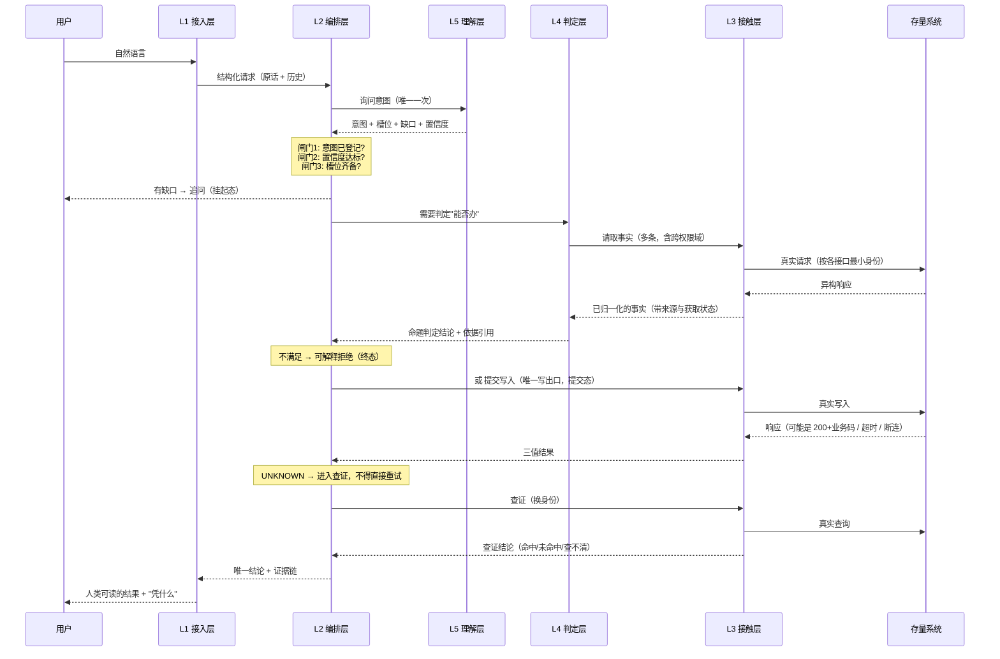

# 02 · 总体架构与分层方案

> 本章解决：**这个系统分成哪几块、谁依赖谁、哪些边界必须由结构保证而不能靠自觉。**
>
> 依据：`docs/基线文档/智能体设计.md` §七（六命题 → 模块的追溯关系）。本章是它的展开，不是重写。
>
> **本章不含代码。** 凡涉及"怎么检查"的地方，写的是**检查规则**，不是实现。

---

## 一、先纠正一个关于"架构"的常见误解

多数架构文档在画框：这是 A 层、那是 B 层。画完看不出为什么必须是这个形状，换一种画法似乎也行。

**架构真正的产出不是框图，而是"哪些决定可以各自独立地改"。**

- 换一个大模型厂商 → 只有理解层受影响
- 存量系统升级改了字段名 → 只有接触层受影响
- 想调整"拒绝时怎么说话" → 只有判定层的命题话术受影响

**如果一次改动波及三层以上，说明分层是假的。**

所以本章的每一层都要回答两个问题：**① 它承担哪条命题？② 它对外承诺什么、因此可以独立于谁？**

---

## 二、分层不是拍脑袋：六条命题逼出的六个位置

`智能体设计.md` §七已经给出命题与模块的追溯关系。这里把它转换成**分层**语言——层是"承诺边界"，模块是层的内部实现。

| 命题 | 系统必须回答 | 承担的层 | 这一层对外承诺什么 |
|---|---|---|---|
| **P1** | 用户要办什么？还缺什么？ | **理解层** | "给我一段自然语言与对话历史，我还你一个**受 Schema 约束**的结构化意图；我给不了执行，也绝不触碰业务规则" |
| **P2** | 现在能不能办？依据什么事实？ | **判定层** | "给我一个结构化意图，我还你一份**事实集 + 命题判定结论 + 依据引用**；我不发任何写请求" |
| **P3** | 该以什么身份、什么形态发出？ | **接触层** | "给我一个逻辑调用名 + 参数，我还你一个**三值结果**；我不理解业务、不判断该不该调" |
| **P4** | 结果到底是什么？ | **编排层** | "给我一个意图，我负责把它走完，并给出**唯一确定的结论**；我不直接碰网络、不直接读配置文件" |
| **P5** | 出事了怎么恢复到可解释状态？ | **编排层**（补偿子域） | 同上 |
| **P6** | 凭什么说自己做对了？ | **证据层**（横切） | "系统里发生的每一件有后果的事，都能被复述出**依据**" |

> **这就是分层的正当性来源**：每一层不是"业界都这么分"，而是**被一条命题逼出来的**。删掉任何一层，就有命题无人回答。

---

## 三、层次结构（五层 + 三条横切）

```text
┌──────────────────────────────────────────────────────────────┐
│  L1 接入层      对话入口（HTTP / SSE 事件流）                     │
│                职责：协议解包、入参形状校验、响应包装、事件流推送     │
│                禁止：任何业务判断                                 │
└───────────────────────────┬──────────────────────────────────┘
                            │ 结构化请求（不是自然语言里的业务语义）
┌───────────────────────────▼──────────────────────────────────┐
│  L2 编排层      任务推进的中枢：把意图走完并给出唯一结论            │
│                职责：状态推进、分支、重试决策、补偿决策、循环上限     │
│                禁止：直接发 HTTP、直接解析数据文件、直接调 LLM        │
│                     （注册表等数据须经"配置访问入口"读取，见 §八注释）  │
└───────┬─────────────────────────────────┬────────────────────┘
        │ 要"事实与判定"                    │ 要"发一次调用"
┌───────▼──────────────────┐   ┌──────────▼────────────────────┐
│  L4 判定层                │   │  L3 接触层                     │
│   事实聚合 + 命题校验       │   │   防腐网关：协议适配 / 身份池    │
│  职责：收齐事实、判命题      │   │   / 故障注入点 / 三值归一        │
│  禁止：发任何写请求          │   │  职责：把逻辑调用变成真实请求     │
│        （只读也在网关里发）   │   │  禁止：业务判定、重试决策        │
└──────────────────────────┘   └──────────┬────────────────────┘
                                          │
                            ┌─────────────▼──────────────────┐
                            │  存量业务系统（不可修改）          │
                            └────────────────────────────────┘

L5 理解层（独立旁路，只被 L2 调用）
  职责：自然语言 → 结构化意图 + 槽位 + 缺口 + 置信度
  禁止：决定调用哪个接口、接触业务规则、产生任何副作用

──────────────────── 三条横切 ────────────────────
证据层      记录每一步的输入、依据、结论（P6）
配置        注册表 / 计划模板 / 身份声明（数据，不是逻辑）
规范口径    时间归一化、命名映射、常量（被各层共用，但不含判定）
```

> **注（一审澄清，2026-09-25）**：L1 的事件流（SSE）**不是"后续可加"的可选项**——第 10 章 §六 已把"边执行边推送的事件流"定为轨迹视图的唯一数据来源（界面与证据链同源）。L1 的职责应读作"协议解包、入参形状校验、响应包装、**事件流推送**"，实现须在阶段 4 一并交付，不得后补。

### 3.1 为什么接触层（L3）与判定层（L4）是分开的

这是本章最容易引起争议的一处切分，必须论证。

**直觉上的画法是**：网关负责调接口，校验层负责判条件，两者并列在编排层下面。**但那样切，"调用"与"判断"会互相渗透**——校验层为了拿到事实会自己发请求，网关为了判断"这算不算成功"会自己实现业务语义。

**改成现在这样，两条约束变得可检查**：

| 约束 | 由哪个切分保证 |
|---|---|
| 事实的**获取**与事实的**判定**分离 | L4 只声明"我需要哪些事实"，获取动作在 L3 完成；L4 拿到的永远是已归一化的事实，不是 HTTP 响应 |
| **只有一处**能发请求 | L3 是唯一的 HTTP 出口（见 §四） |

**代价**：一次"读事实"要跨越 L2 → L4 → L3 → 存量系统 → L3 → L4 → L2，比"校验层自己发请求"多两层。

**为什么接受这个代价**：因为这两条约束是这个项目的**立论**（"跨权限域聚合"与"三值判定"）。把它们变成可检查的结构约束，比省两层调用重要得多。

> **可行性评估点**：需要你确认是否接受"事实获取统一走接触层"这个较绕的路径。我判断不了的是：实际实现时这条路径带来的样板代码量是否超出你的容忍度。备选是允许判定层在**只读**场景下直接走接触层（省去 L2 中转），代价是"唯一写出口"这条约束仍在，但"唯一读出口"会变弱。**我的倾向是保持现状**，因为读写对称能让规则更简单。

### 3.2 为什么理解层是"旁路"而不是一层

理解层不在主链路上被"穿过"，而是被编排层**询问**一次。

**理由**：它是**唯一的非确定性来源**。若把它放在主链路上（例如"每步都可以问 LLM"），非确定性就会沿着链路扩散，证据链将无法复述"为什么调了这个接口"。

**表现为三条**：

1. 理解层在一件事里**最多被调用一次**（开头），除非进入追问轮
2. 理解层的输出**不进入证据链**，单独留档（它是非确定性的，不能作为依据）
3. **不经过理解层，链路也必须能跑通**——直接喂结构化任务即可。这不是可测试性的附属品，是"LLM 只是可替换外部依赖"的证明

> **可行性评估点**：需要你确认"一件事只问一次 LLM"。我判断不了的是：业务上是否存在"执行到中途才发现信息不够、需要再问用户"的场景。**我的倾向是**：若中途发现槽位不足，不重新问 LLM，而是直接把结构性缺口上报给用户（由编排层生成追问话术），因为此时缺什么已经确定，不需要 LLM 再猜一次。

---

## 四、依赖方向与三条"机器化"约束

**依赖方向**（单向，禁止反向）：

```text
L1 接入层  →  L2 编排层  →  L4 判定层  →  L3 接触层  →  存量系统
                    └─→  L5 理解层（旁路）
横切：各层 → 证据层、配置、规范口径（横切不被反向依赖）
```

**注意 L4 → L3 的方向**：判定层可以**要求**接触层去取事实，但判定层不得自己构造 HTTP。

### 三条约束，以及"怎么检查"

这里不用代码，用**检查规则**。三条约束都设计成"能被一条 grep 式规则判否"。

#### 约束 A：唯一 HTTP 出口

**规则**：全仓库范围内，发起对存量系统网络调用的写法**只允许出现在接触层**。

- 检查规则：搜索 HTTP 客户端用法与存量系统地址的出现位置；除接触层与配置外，命中即为违规
- 违规的典型形态：判定层为了拿一个事实自己写了个请求；编排层为了"快一点"直接调了一个接口

**为什么这条必须死守**：一旦出口不止一处，**三值判定就会被绕过**。绕过三值判定的调用只能返回二值结论，而二值结论在超时场景下必然猜错——这正是本项目要消除的东西。

#### 约束 B：唯一副作用出口

**规则**：有副作用的调用，**只能由编排层在"提交态"这一个状态发出**。

- 检查规则：所有标记为"有副作用"的逻辑调用名，其调用点必须位于提交态的处理分支内；出现在其他状态即为违规
- 违规的典型形态：为了"顺便校验一下能不能写"而试发一次；补偿逻辑与提交逻辑共用同一段代码导致补偿被误判为提交

**为什么**：副作用是唯一不可自动撤销的东西。把它压缩到**唯一一个状态**，等于把"什么时候可能弄脏数据"从"到处都有可能"缩小到"一个可枚举的位置"。

#### 约束 C：唯一非确定性入口

**规则**：调用大模型的能力**只允许出现在理解层**。

- 检查规则：搜索模型客户端用法的出现位置；除理解层外命中即为违规
- 违规的典型形态：让模型"帮我看看这算不算冲突"（把业务判定交给非确定性组件，直接破坏 I4）

**为什么**：非确定性一旦扩散进执行链，"同一输入同一输出"就不再成立，故障无法重放，**第 09 章的混沌实验将失去意义**——因为无法区分失败是注入的故障还是模型这次的发挥。

### 4.2 这三条约束与"是否使用第三方库"无关

必须显式写清楚，避免与 README 的依赖策略混淆：

> 允许引入第三方 HTTP 客户端、校验库、日志库，**都不改变这三条约束**。约束约束的是"**位置**"，不是"**工具**"。
>
> 反过来说：**不用第三方库也不会自动满足这三条约束。** 用内置 `fetch` 却写在判定层，一样是违规。

---

## 五、一次办事的完整数据流

以"帮我借周三下午数智楼 222"为例，逐段标注跨越了哪些层。



**这张图的三个要点**：

1. **用户看得见的那两次往返（追问、结果）之外，用户看不到但发生了 5–8 次真实请求**——这就是"跨接口聚合"的实际工作量
2. **编排层从不上网**，它只下发"要事实"与"发调用"两种意图
3. **接触层不判断该不该调**。它甚至不知道"现在是提交阶段还是查证阶段"，它只按收到的东西发请求

---

## 六、六条不变量的落点

不变量必须有**唯一的落点层**，否则"谁负责"会说不清。

| 不变量 | 落点层 | 该层用什么保证 | 若该层失效会怎样 |
|---|---|---|---|
| **I1** 事实齐备方可写入 | **L2 + L4** | L4 按命题声明的依赖集强制收集；L2 在提交态之前**没有**通往副作用的边（结构上不可能跳过） | 会向存量系统写脏数据，不可逆 |
| **I2** 至多一条有效记录 | **L2 + L3** | L2 的幂等守卫（提交前查重、重试前查证）；L3 保证同一逻辑调用的参数形态一致 | 重复占用，且用户可能被误报 |
| **I3** 结果唯一确定 | **L3 + L2** | L3 只吐三值，不吐原响应；L2 的 UNKNOWN 状态**没有**直通终态的边，必须先经过查证态 | 用户被误报，系统状态与用户认知不一致 |
| **I4** 可解释 | **证据层（横切）** | 每个有后果的动作都强制携带"依据引用"；缺依据的记录在自检中报错 | 无法回答"为什么"，退化成一个脚本 |
| **I5** 最小身份 | **L3** | 身份按注册表声明的所需角色取用；越权响应必须被识别为失败而非成功 | 越权面扩大；`200+code403` 被当成成功 |
| **I6** 副作用可收敛 | **L2（补偿子域）** | 每个写调用必须声明补偿动作或显式登记为不可补偿；不可补偿的写调用**不得**进入自动链路 | 半成品留在库里且无人知晓 |

> **注意 I1 的落点写法**。它同时落在 L2 与 L4，但分工不同：**L4 负责"事实够不够"，L2 负责"结构上到不了副作用"**。两者是冗余的，冗余是有意的——L4 的判断可能被写错，L2 的结构不能被绕过。

---

## 七、进程与部署形态

**决定：三个进程，各自独立，不引入服务发现、消息队列、容器编排。**

| 进程 | 形态 | 说明 |
|---|---|---|
| 存量系统 | 一个 Java 进程 | 已可运行，保持其默认形态 |
| 编排引擎 | 一个 Node 进程 | 承载 L1–L5 与横切；内部按层分目录，**不拆成多个服务** |
| 对话前端 | 一个静态站点（开发期跑 Vite dev server） | 只与编排引擎通信，**不直连存量系统** |

**为什么不把编排引擎拆成多个服务**：

| 备选 | 为什么不选 |
|---|---|
| 理解层独立成服务 | 它一件事只被调一次，拆出去只增加一次网络往返与一个故障点 |
| 网关独立成服务 | 一旦独立，"唯一出口"就变成"多个出口指向同一个上游"，结构约束的可检查性反而下降 |
| 引入消息队列做异步 | 本项目是**同步办事**语义（用户等着结果），异步化只会让"唯一确定结论"更难保证 |

**唯一的进程间约束**：前端**不得**直连存量系统。若前端能直连，"零侵入 + 接触面收敛"的主张就不成立了——存量系统的接口会被两个调用方以不同方式使用。

> **可行性评估点**：需要你确认前端是否需要"直接展示存量系统的原始响应"（例如答辩时想让评委看到原始 JSON）。我判断不了的是：答辩现场是否需要这种"现场感"。若需要，正确做法是**由编排引擎在证据链里保留原响应片段**，而不是让前端直连。

---

## 八、配置的形态：注册表是数据，不是代码

**决定：与存量系统有关的一切外部知识，都以"数据"的形式集中在一处**，包括：

| 数据 | 内容 | 谁读它 |
|---|---|---|
| **接口注册表** | 每个纳管接口的全部元信息（第 01 章 §四的 **13 个字段**——二审补齐"是否允许自动编排"后由 12 增至 13） | 接触层（怎么发）、判定层（要哪些事实）、编排层（能不能写）。**编排层经"配置访问入口"读取，不得在业务逻辑里直接解析数据文件**（§三 L2 禁止项；第 13 章 §阶段 3 禁止项 ③） |
| **意图计划** | 意图 → 步骤链 → 所需命题 → 降级策略 | 编排层 |
| **身份声明** | 有哪些身份、其凭证从哪来 | 接触层 |

**为什么把注册表当数据而不是当代码**：

| 理由 | 说明 |
|---|---|
| 改动面小 | 存量系统加一个接口，只改一处数据；写死在代码里要改多处并重新走查 |
| 可被复核 | 第 01 章的 12 条纳管清单可以逐行对着数据核对，代码里的常量做不到 |
| 可被自检 | 数据可以被"完整性检查"扫描（见第 13 章验收清单）；散落的代码常量不能 |

**推论**：**禁止在业务逻辑里硬编码接口路径、字段名、身份名、状态值集合。** 这些都来自注册表或规范口径。

> **二审澄清（"配置访问入口"是什么）**：§三 的 L2 禁止项写的是"**直接解析数据文件**"，**不是**"不许使用注册表数据"——编排层确实需要知道"这个接口能不能写"（本节的"谁读它"列）。区别在**访问方式**：编排层必须经**统一入口**读（由一个模块负责读文件、校验完整性、暴露语义化查询），**不得在业务逻辑里自行读文件再解析**。收益有两条：数据完整性可被自检（第 13 章 §四 纪律 2），以及换格式只改一处。

> **可行性评估点**：需要你确认注册表用**什么格式**承载（JSON / YAML / JS 模块）。我判断不了的是：你是否需要"在注册表里写注释解释每条实测结论"——JSON 不支持注释，YAML 支持。**我的倾向是 YAML**，因为第 01 章每条接口都带有实测注意事项，这些注释本身就是文档的一部分。

---

## 九、明确排除的架构做法

| # | 排除 | 理由 |
|---|---|---|
| 1 | ~~让 LLM 直接 function calling~~ | 不可解释、不可复现、幻觉直落副作用（第 03 章展开） |
| 2 | ~~引入工作流引擎（Flowable / Temporal）~~ | 状态机是核心创新点，外包等于自拆立论；十余状态的量级也不需要引擎 |
| 3 | ~~把编排引擎拆成微服务~~ | 见 §七；只增加故障点与"唯一出口"的模糊度 |
| 4 | ~~前端直连存量系统~~ | 破坏"接触面收敛"，见 §七 |
| 5 | ~~在业务逻辑里硬编码接口路径/字段名/状态值~~ | 见 §八 |
| 6 | ~~把"事实收集"与"事实判定"合并在一个模块~~ | 会让"谁负责正确性"说不清，见 §3.1 |
| 7 | ~~为将来可能的扩展预留空层/空模块~~ | 空层会诱发"先建了就该用"的填充冲动，违反"结构从命题长出来" |
| 8 | ~~用两态（成功/失败）替换三值~~ | 与 I3 直接冲突 |

---

## 十、本章待决清单

| # | 待决 | 类型 | 我的倾向 |
|---|---|---|---|
| 1 | 是否接受"事实获取统一走接触层"（多两层中转） | **需决策** | 接受，读写对称让规则更简单 |
| 2 | 一件事只问一次 LLM，中途缺槽位由编排层直接追问 | **需决策** | 接受，此时缺什么已确定，不需再猜 |
| 3 | 注册表承载格式：YAML vs JSON | **需决策** | YAML（需要写实测注释） |
| 4 | 前端是否需要展示存量系统原始响应 | **需决策** | 不需要；如需"现场感"，由证据链保留原响应片段 |
| 5 | 是否需要"多轮对话的任务续跑"（关掉页面后回来接着办） | **需决策** | 暂不需要；挂起态只在会话内有效。若要，须先定义"会话"的生命周期 |
| 6 | 部署形态是否需要容器化 | **需实测** | 演示机直接跑三个进程即可；存量系统自身带 `docker-compose`，是否用它需要现场试 |
| 7 | 编排引擎默认端口 | **需决策** | 待第 11 章定（存量系统已占 8080，需避开） |

---

*上一章：[01-存量接口纳管方案](./01-存量接口纳管方案.md) ｜ 下一章：[03-智能体职责划分与理解层方案](./03-智能体职责划分与理解层方案.md)*
